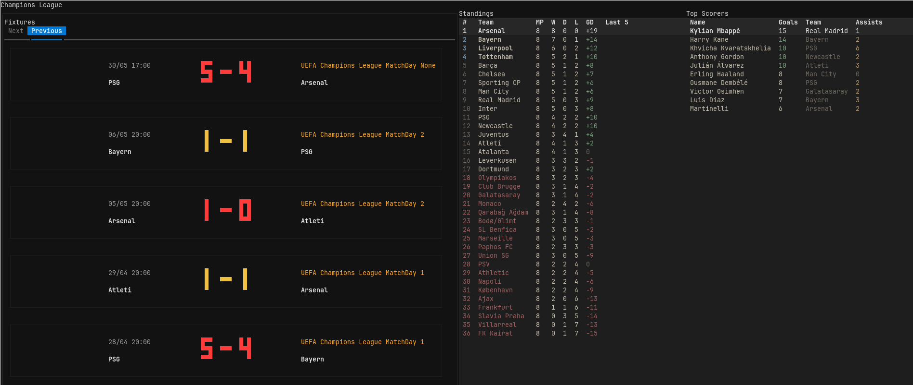

# kickoff

Kickoff is a CLI to get football info built with Textual. It shows fixtures, previous results, league standings, and top scorers in a split-pane interface. The app is designed to stay useful even when the upstream API is incomplete or rate-limited, so the experience is resilient rather than fragile.



## 1. What It Does

Kickoff helps you browse football data without leaving the terminal. You can:

- Switch between leagues from one screen.
- Browse next and previous fixtures.
- Inspect standings and top scorers.
- See local kickoff times instead of raw UTC timestamps.
- Keep using the app when some API fields are missing or temporarily unavailable.

## 2. Features

- Fixture views that separate upcoming and completed matches.
- League screens for standings, fixtures, and scorers.
- Defensive parsing for null scores, missing teams, and partial API responses.
- Local caching and retry handling in the API client.
- A Textual UI with keyboard shortcuts and a responsive layout.
- Test coverage for the parsing and score-rendering edge cases.

## 3. Quick Start

Requirements:

- Python 3.14 or newer
- An API token and base URL for the football data source
- `uv` installed locally

Install dependencies:

```bash
uv sync
```

Create a `.env` file from the example and fill in the values:

```bash
cp .env.example .env
```

Run the app:

```bash
uv run python main.py
```

## 4. Configuration

Kickoff reads its settings from environment variables:

- `API_TOKEN`: your football data API token
- `BASE_URL`: the API base URL

If either value is missing, the app fails fast with a clear error message so setup issues are obvious immediately.

## 5. How It Works

The project is split into a few small layers:

- `api/` handles HTTP requests, caching, retries, and API access.
- `models/` turns football-data responses into typed Python objects.
- `ui/` renders the Textual interface and coordinates screen state.
- `utils.py` holds shared helpers such as competition lookup and UTC parsing.
- `tests/` covers the parsing behavior and score rendering helpers.

Run the test suite with:

```bash
uv run pytest -q
```

## Design Choices

Kickoff favors reliability over strict assumptions. The API layer fails fast on missing configuration, caches responses locally, and retries on 429 responses so temporary rate limits do not break the app. The model layer tolerates null score objects, null teams, and missing scorer fields because the upstream data is not always complete.

The UI keeps completed fixtures separate from upcoming matches, shows kickoff times in the user’s local timezone, and surfaces error rows instead of leaving the interface stuck behind a spinner. The score rendering and standings formatting are also intentionally small and explicit so they are easy to test and easy to reason about.

The overall goal is a terminal app that feels polished to use while still being straightforward to maintain.
